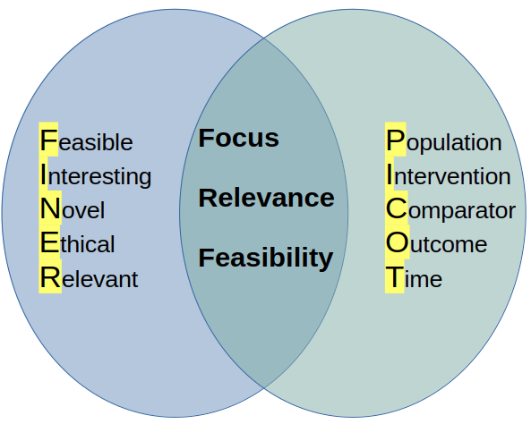

<section id="title-slide" data-background-image="./assets/Building_Dusk_Background.jpg" data-background-opacity="0.2" data-state="title">
  <h1>I want to do research, where do I start ?</h1>
  
Presented by Chris Oldmeadow

  
Date: 11th March 2024

</section>

## Presentation Overview

- Developing a Research Question

- Key Components of Effective Research Questions

- Applying Frameworks to Construct Research Questions

- From Questions to Objectives

- Population Selection and Eligibility Criteria 

- Understanding Clinical Trial Endpoints

- Significance of Sample Size and Power in Research

## 

> "Research is to see what everybody else has seen, and to think what nobody else has thought."  
> - Albert Szent-Györgyi

A well-formulated question is the first step in thinking differently about what we observe

## Developing a Research Question {data-background-image="./assets/library.webp" data-background-opacity="0.2"}
   - Identify a gap: reviewing literature, attending conferences, and engaging with the community.
   - Formulate the question: frameworks like **PICO** (Population, Intervention, Comparator, Outcome) and **FINER** (Feasible, Intersting, Novel, Ethical , Relvent ).
   - Statistical considerations from the start — feasibility of study design, data collection methods, and preliminary data analysis plans.

## Crafting Research Questions 

- Research question: A **clearly defined** query that your research aims to answer. It guides the focus of your study and is the starting point of your research.
- A well-crafted research question should be *specific* , *feasible*, and *relevant*, addressing gaps in the current knowledge.

 

## Example

- Bad: Is the new radiotherapy technique beneficial for lung cancer patients?

- Better: Investigating the efficacy of high-precision, image-guided radiotherapy (*Intervention*) in extending survival (*Outcome*) among patients with advanced lung cancer (*Population*) compared to the current standard of care (*Comparator*) over a two-year period (*Time*).

## The importance of Systematic Review {data-background-image="./assets/lit_review.webp" data-background-opacity="0.2"}

- Foundation for research: lays the groundwork by compiling and analysing all relevant studies on a topic.
- Identifying gaps: uncovering **research gaps**, which directly informs the development of research objectives.
- Refining research questions: insights from a systematic review can lead to **refining** the question for **clarity** and **focus**

## More considerations for good research questions
   - What is the appropriate stage for evaluation?
   - Can internal validity be achieved?
   - To what extent is external validity (generalisability) achievable?
   - What will your circumstances permit?
   -  What can you afford?
   - What is the best balance between “idea” and “feasibility”? 

## Setting Research Objectives

   - Research objectives: Breakdown the research question into smaller, **manageable goals**. 

   - Defined using *SMART* criteria: Specific, Measurable, Achievable, Realistic, Time-defined.
   
   - Aim for **clarity** and **specificity** to guide your research direction effectively.

## Example Research Objectives

- Primary objective:
  -  To determine the difference in two-year overall survival rates between stage III non-small cell lung cancer patients treated with high-precision, image-guided radiotherapy versus those treated with conventional conformal radiotherapy.

- Secondary objective:
  -  To assess the impact of high-precision, image-guided radiotherapy on the quality of life of stage III non-small cell lung cancer patients at 12 months post randomisation, compared to the impact of conventional conformal radiotherapy.

## Population Selection & Eligibility

- Trial phase impact
  - Early phases: Homogeneous populations for focused insights.
  - Later phases: Heterogeneous populations for broader applicability.

- Considerations
    - Safety is paramount.
    - Flexible entry criteria to ensure timely enrolment.

## Clinical Trial Endpoints

- Purpose & types
  - Guide trials: Primary (main outcome) and Secondary (supplementary insights).
  - Common types: Continuous, Categorical, Event-time.

- Characteristics of primary endpoint
  - Clinically relevant, interpretable, sensitive, practical, and validated.

- Considerations
  - Objective vs. Subjective: Importance of blinding.

## Common endpoints in Cancer research

- Overall survival: Gold standard primary 
- Complete response/ Objective response rate: A surrogate marker 
- Progression-free survival: A surrogate marker, common in phase 2 trials
- Health related quality of life 

## Sample size/power {data-background-image="./assets/creditss.jpg" data-background-opacity="0.2"}

- Sample size determination
  - Balances precision, feasibility, and resources.
  - Influenced by expected effect size, variability, and significance level (α).

- Power (1-β)
  - Probability of detecting a true effect.
  - Aim for 80-90% power: Minimises risk of Type II error (failing to detect a real effect).

 - Impact on clinical trials
   - Adequate sample size and power ensure reliable, generalisable results.

## Summary

- Start with an idea
- Use frameworks to get a research question
- Revise this question with literature review
- Start to consider populations and outcomes
- Talk to a statistician as soon as possible

<!-- To convert this markdown file into a HTML presentation, you would use the command pandoc -s -t revealjs  -V revealjs-url=https://unpkg.com/reveal.js/ -o presentation.html mypresentation.md. This tells pandoc to create a standalone (-s) reveal.js presentation (-t revealjs) with the output filename of presentation.html from the input file mypresentation.md.

You can also add other options like -V revealjs-url=path/to/reveal.js if reveal.js is not in the default path and other reveal.js specific options in the YAML front matter to customize the presentation. -->

